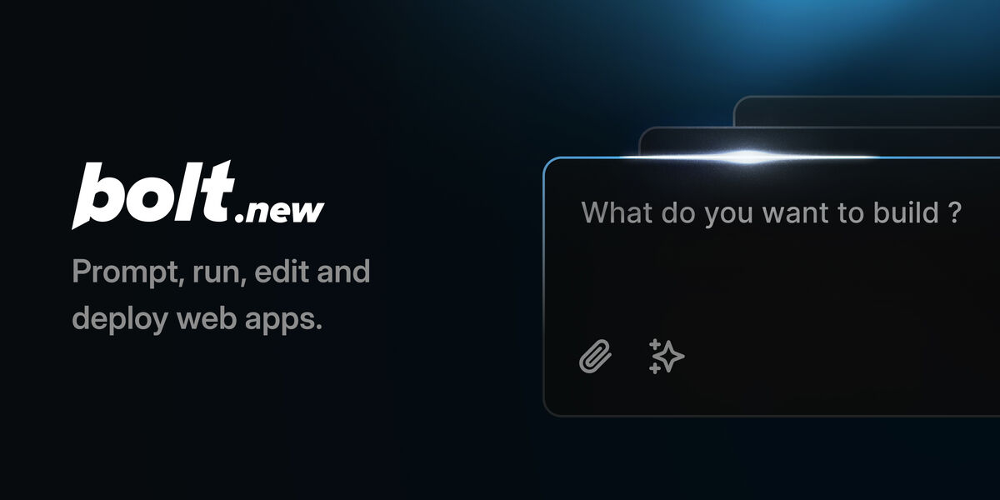

[](https://bolt.new)

# Bolt.new Fork by Cole Medin - oTToDev

This fork of Bolt.new (oTToDev) allows you to choose the LLM that you use for each prompt! Currently, you can use OpenAI, Anthropic, Ollama, OpenRouter, Gemini, LMStudio, Mistral, xAI, HuggingFace, DeepSeek, or Groq models - and it is easily extended to use any other model supported by the Vercel AI SDK! See the instructions below for running this locally and extending it to include more models.

Check the [oTToDev Docs](https://coleam00.github.io/bolt.new-any-llm/) for more information.

## Join the community for oTToDev!

https://thinktank.ottomator.ai


## Requested Additions - Feel Free to Contribute!

- ✅ OpenRouter Integration (@coleam00)
- ✅ Gemini Integration (@jonathands)
- ✅ Autogenerate Ollama models from what is downloaded (@yunatamos)
- ✅ Filter models by provider (@jasonm23)
- ✅ Download project as ZIP (@fabwaseem)
- ✅ Improvements to the main Bolt.new prompt in `app\lib\.server\llm\prompts.ts` (@kofi-bhr)
- ✅ DeepSeek API Integration (@zenith110)
- ✅ Mistral API Integration (@ArulGandhi)
- ✅ "Open AI Like" API Integration (@ZerxZ)
- ✅ Ability to sync files (one way sync) to local folder (@muzafferkadir)
- ✅ Containerize the application with Docker for easy installation (@aaronbolton)
- ✅ Publish projects directly to GitHub (@goncaloalves)
- ✅ Ability to enter API keys in the UI (@ali00209)
- ✅ xAI Grok Beta Integration (@milutinke)
- ✅ LM Studio Integration (@karrot0)
- ✅ HuggingFace Integration (@ahsan3219)
- ✅ Bolt terminal to see the output of LLM run commands (@thecodacus)
- ✅ Streaming of code output (@thecodacus)
- ✅ Ability to revert code to earlier version (@wonderwhy-er)
- ✅ Cohere Integration (@hasanraiyan)
- ✅ Dynamic model max token length (@hasanraiyan)
- ✅ Better prompt enhancing (@SujalXplores)
- ✅ Prompt caching (@SujalXplores)
- ✅ Load local projects into the app (@wonderwhy-er)
- ✅ Together Integration (@mouimet-infinisoft)
- ✅ Mobile friendly (@qwikode)
- ✅ Better prompt enhancing (@SujalXplores)
- ✅ Attach images to prompts (@atrokhym)
- ✅ Detect package.json and commands to auto install and run preview for folder and git import (@wonderwhy-er)
- ⬜ **HIGH PRIORITY** - Prevent Bolt from rewriting files as often (file locking and diffs)
- ⬜ **HIGH PRIORITY** - Better prompting for smaller LLMs (code window sometimes doesn't start)
- ⬜ **HIGH PRIORITY** - Run agents in the backend as opposed to a single model call
- ⬜ Deploy directly to Vercel/Netlify/other similar platforms
- ⬜ Have LLM plan the project in a MD file for better results/transparency
- ⬜ VSCode Integration with git-like confirmations
- ⬜ Upload documents for knowledge - UI design templates, a code base to reference coding style, etc.
- ⬜ Voice prompting
- ⬜ Azure Open AI API Integration
- ⬜ Perplexity Integration
- ⬜ Vertex AI Integration

## Bolt.new: AI-Powered Full-Stack Web Development in the Browser

Bolt.new is an AI-powered web development agent that allows you to prompt, run, edit, and deploy full-stack applications directly from your browser—no local setup required. If you're here to build your own AI-powered web dev agent using the Bolt open source codebase, [click here to get started!](./CONTRIBUTING.md)

## What Makes Bolt.new Different

Claude, v0, etc are incredible- but you can't install packages, run backends, or edit code. That’s where Bolt.new stands out:

- **Full-Stack in the Browser**: Bolt.new integrates cutting-edge AI models with an in-browser development environment powered by **StackBlitz’s WebContainers**. This allows you to:
  - Install and run npm tools and libraries (like Vite, Next.js, and more)
  - Run Node.js servers
  - Interact with third-party APIs
  - Deploy to production from chat
  - Share your work via a URL

- **AI with Environment Control**: Unlike traditional dev environments where the AI can only assist in code generation, Bolt.new gives AI models **complete control** over the entire  environment including the filesystem, node server, package manager, terminal, and browser console. This empowers AI agents to handle the whole app lifecycle—from creation to deployment.

Whether you’re an experienced developer, a PM, or a designer, Bolt.new allows you to easily build production-grade full-stack applications.

For developers interested in building their own AI-powered development tools with WebContainers, check out the open-source Bolt codebase in this repo!

## Setup

Many of you are new users to installing software from Github. If you have any installation troubles reach out and submit an "issue" using the links above, or feel free to enhance this documentation by forking, editing the instructions, and doing a pull request.

1. Install Git from https://git-scm.com/downloads

2. Install Node.js from https://nodejs.org/en/download/ 

Pay attention to the installer notes after completion. 

On all operating systems, the path to Node.js should automatically be added to your system path. But you can check your path if you want to be sure. On Windows, you can search for "edit the system environment variables" in your system, select "Environment Variables..." once you are in the system properties, and then check for a path to Node in your "Path" system variable. On a Mac or Linux machine, it will tell you to check if /usr/local/bin is in your $PATH. To determine if usr/local/bin is included in $PATH open your Terminal and run:

```
echo $PATH .
```

If you see usr/local/bin in the output then you're good to go.

3. Clone the repository (if you haven't already) by opening a Terminal window (or CMD with admin permissions) and then typing in this:

```
git clone https://github.com/coleam00/bolt.new-any-llm.git
```

3. Rename .env.example to .env.local and add your LLM API keys. You will find this file on a Mac at "[your name]/bold.new-any-llm/.env.example". For Windows and Linux the path will be similar.


If you can't see the file indicated above, its likely you can't view hidden files. On Mac, open a Terminal window and enter this command below. On Windows, you will see the hidden files option in File Explorer Settings. A quick Google search will help you if you are stuck here.

```
defaults write com.apple.finder AppleShowAllFiles YES
```

**NOTE**: you only have to set the ones you want to use and Ollama doesn't need an API key because it runs locally on your computer:

Get your GROQ API Key here: https://console.groq.com/keys

Get your Open AI API Key by following these instructions: https://help.openai.com/en/articles/4936850-where-do-i-find-my-openai-api-key

Get your Anthropic API Key in your account settings: https://console.anthropic.com/settings/keys

```
GROQ_API_KEY=XXX
OPENAI_API_KEY=XXX
ANTHROPIC_API_KEY=XXX
```

Optionally, you can set the debug level:

```
VITE_LOG_LEVEL=debug
```

And if using Ollama set the DEFAULT_NUM_CTX, the example below uses 8K context and ollama running on localhost port 11434:

```
OLLAMA_API_BASE_URL=http://localhost:11434
DEFAULT_NUM_CTX=8192
```

**Important**: Never commit your `.env.local` file to version control. It's already included in .gitignore.

## Run with Docker

Prerequisites:

Git and Node.js as mentioned above, as well as Docker: https://www.docker.com/

### 1a. Using Helper Scripts

NPM scripts are provided for convenient building:

```bash
# Development build
npm run dockerbuild

# Production build
npm run dockerbuild:prod
```

### 1b. Direct Docker Build Commands (alternative to using NPM scripts)

You can use Docker's target feature to specify the build environment instead of using NPM scripts if you wish:

```bash
# Development build
docker build . --target bolt-ai-development

# Production build
docker build . --target bolt-ai-production
```

### 2. Docker Compose with Profiles to Run the Container

Use Docker Compose profiles to manage different environments:

```bash
# Development environment
docker-compose --profile development up

# Production environment
docker-compose --profile production up
```

When you run the Docker Compose command with the development profile, any changes you
make on your machine to the code will automatically be reflected in the site running
on the container (i.e. hot reloading still applies!).

## Run Without Docker

1. Install dependencies using Terminal (or CMD in Windows with admin permissions):

```
pnpm install
```

If you get an error saying "command not found: pnpm" or similar, then that means pnpm isn't installed. You can install it via this:

```
sudo npm install -g pnpm
```

2. Start the application with the command:

```bash
pnpm run dev
```
## Available Scripts

- `pnpm run dev`: Starts the development server.
- `pnpm run build`: Builds the project.
- `pnpm run start`: Runs the built application locally using Wrangler Pages. This script uses `bindings.sh` to set up necessary bindings so you don't have to duplicate environment variables.
- `pnpm run preview`: Builds the project and then starts it locally, useful for testing the production build. Note, HTTP streaming currently doesn't work as expected with `wrangler pages dev`.
- `pnpm test`: Runs the test suite using Vitest.
- `pnpm run typecheck`: Runs TypeScript type checking.
- `pnpm run typegen`: Generates TypeScript types using Wrangler.
- `pnpm run deploy`: Builds the project and deploys it to Cloudflare Pages.
- `pnpm run lint:fix`: Runs the linter and automatically fixes issues according to your ESLint configuration. 

## Development

To start the development server:

```bash
pnpm run dev
```

This will start the Remix Vite development server. You will need Google Chrome Canary to run this locally if you use Chrome! It's an easy install and a good browser for web development anyway.

## How do I contribute to oTToDev?

[Please check out our dedicated page for contributing to oTToDev here!](CONTRIBUTING.md)

## What are the future plans for oTToDev?

[Check out our Roadmap here!](https://roadmap.sh/r/ottodev-roadmap-2ovzo)

Lot more updates to this roadmap coming soon!

## FAQ

[Please check out our dedicated page for FAQ's related to oTToDev here!](FAQ.md)
